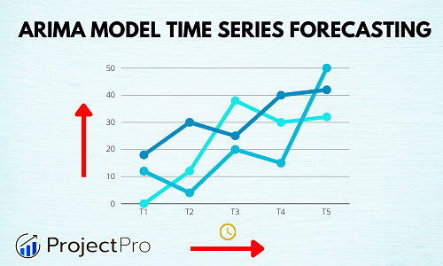

  
  <h3>Time Series Project using one of the strongest algorithm called <b style="color:red">ARIMA</b></h3> 
  <h3><a href="https://www.kaggle.com/psundar/globallandtemperature">Dataset</a> is not small, that's why I didn't upload it here. You should download it on your own</h3>

